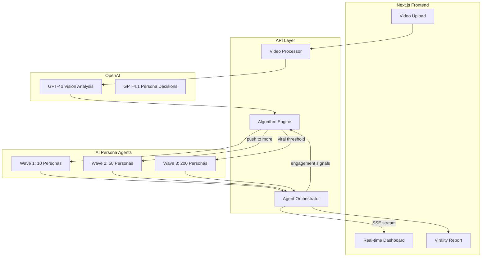

# Virality Prediction Simulator

## Concept

Upload a video → GPT-4o vision analyzes it → A simulated Instagram algorithm exposes it to waves of AI personas → Personas decide to like/comment/share/skip → The algorithm uses engagement signals to push content to the next wave → Real-time visualization of spread → Final virality score + breakdown.

## Architecture



## Core Components

### 1. Video + Audio Processor (`src/lib/video-processor.ts`)
- Accept video upload (MP4, MOV, WebM) — max 60s
- Extract 5-8 key frames using ffmpeg (server-side)
- Extract audio track as separate file (ffmpeg: `ffmpeg -i input.mp4 -vn -acodec pcm_s16le output.wav`)
- Extract metadata: duration, resolution, file size, has_audio flag

**Visual Analysis (GPT-4o vision on frames):**
- What is shown (product, person, scenery, etc.)
- Visual quality, lighting, composition
- Text overlays / captions detected
- Emotional tone, energy level
- Content category classification
- Hook strength (first frame / first 3 seconds)

**Audio Analysis (Whisper + GPT-4o audio):**
- Transcribe speech/voiceover via Whisper API
- Detect background music presence and energy level
- Analyze speech tone: confidence, enthusiasm, clarity
- Identify trending sound potential (catchy, repetitive hooks)
- Caption quality: quotability, shareability of key phrases
- Pacing: words-per-minute, pauses, emphasis patterns

**Combined Analysis Output:**
- Audio-visual sync quality (does the energy match?)
- Overall "scroll-stopping" score based on first 3 seconds (visual hook + audio hook)
- Content category with confidence scores

### 2. Persona Generator (`src/lib/personas.ts`)
- Pre-defined persona archetypes representing Instagram demographics:
  - Gen Z trend-follower, Millennial professional, Boomer casual browser, Niche hobbyist, Influencer/creator, etc.
- Each persona has attributes:
  ```typescript
  type Persona = {
    id: string
    name: string
    age: number
    interests: string[]
    scrollBehavior: "fast" | "moderate" | "deep"
    engagementStyle: "lurker" | "liker" | "commenter" | "sharer"
    attentionSpan: number // seconds before scrolling past
    contentPreferences: string[]
    followerCount: number // affects share amplification
  }
  ```
- Wave 1 (10): Matches the user's specified target demographic
- Wave 2 (50): Mixed — some in target demo, some adjacent, some random (simulates Explore page)
- Wave 3 (200): Broad audience (simulates viral spread to general feed)

### 3. Algorithm Engine (`src/lib/algorithm.ts`)
- Simulates Instagram's ranking signals:
  - **Interest score**: How well content matches persona interests
  - **Timeliness**: Engagement velocity in first wave
  - **Relationship**: N/A for new content (Explore-style distribution)
  - **Engagement rate**: likes + comments + shares / impressions
  - **Watch time**: Simulated based on persona attention span vs content hook
  - **Share ratio**: Shares are 10x more valuable than likes
- Decision logic for wave progression:
  - Wave 1 → Wave 2: If engagement rate > 15% in first wave
  - Wave 2 → Wave 3: If engagement rate > 8% AND share rate > 3%
  - Content "dies" if engagement drops below thresholds

### 4. Agent Orchestrator (`src/lib/orchestrator.ts`)
- Runs persona agents in parallel batches (Promise.all with concurrency limit)
- Each agent call = one GPT-4.1 call with persona context + video analysis
- Agent decides ONE action with reasoning:
  ```typescript
  type AgentAction = {
    action: "skip" | "like" | "comment" | "share" | "save"
    watchDuration: number // 0-100% of video
    reasoning: string
    comment?: string // if action is "comment"
    emotionalResponse: string
  }
  ```
- Streams results to frontend via Server-Sent Events as each agent responds
- Uses structured outputs (response_format) for reliable parsing

### 5. Real-time Dashboard (`src/app/page.tsx`)
- **Upload phase**: Drag-and-drop video upload with preview
- **Analysis phase**: Show extracted frames + GPT-4o analysis appearing in real-time
- **Simulation phase**: Animated visualization showing:
  - Network graph of personas as nodes, engagement as edges
  - Wave progression (concentric circles expanding)
  - Live feed of agent comments appearing
  - Engagement metrics ticking up in real-time
- **Results phase**: Final virality report:
  - Virality Score (0-100)
  - Predicted reach estimate
  - Engagement breakdown (likes/comments/shares by wave)
  - Strongest demographic match
  - AI-generated recommendations to improve virality
  - Simulated "comment section" with all agent comments

### 6. UI/UX Design
- Dark theme (Instagram-feel)
- Use `shadcn/ui` for base components
- `framer-motion` for animations
- `recharts` or `visx` for engagement graphs
- Network visualization with `react-force-graph` or custom canvas
- Streaming text effects for AI analysis appearing

## Tech Stack

| Layer | Technology |
|-------|-----------|
| Framework | Next.js 15 (App Router) |
| Language | TypeScript (strict) |
| Styling | Tailwind CSS + shadcn/ui |
| AI | OpenAI SDK (GPT-4o vision + GPT-4.1) |
| Real-time | Server-Sent Events (SSE) |
| Video | ffmpeg.wasm (client) or server-side ffmpeg |
| Visualization | react-force-graph + recharts + framer-motion |
| Validation | Zod |
| State | Zustand (lightweight client state) |

## File Structure

```
src/
  app/
    page.tsx              # Main dashboard UI
    api/
      analyze/route.ts    # Video analysis endpoint
      simulate/route.ts   # SSE endpoint for simulation
  components/
    VideoUpload.tsx       # Drag-drop upload
    AnalysisPanel.tsx     # Shows GPT-4o frame analysis
    SimulationView.tsx    # Real-time agent visualization
    NetworkGraph.tsx      # Force-directed persona graph
    ResultsPanel.tsx      # Final virality report
    CommentFeed.tsx       # Simulated comment section
  lib/
    video-processor.ts    # Frame extraction + vision API
    personas.ts           # Persona definitions + generator
    algorithm.ts          # Instagram algo simulation
    orchestrator.ts       # Agent execution + streaming
    openai.ts             # OpenAI client wrapper
  types/
    index.ts              # All shared types
```

## Demo Flow (for judges)

1. Open the app — beautiful dark UI with "Predict Your Virality" headline
2. Upload a 15-second product demo video
3. Watch frames get extracted and AI analysis stream in real-time
4. Simulation begins — network graph animates as personas engage
5. Comments appear in a simulated feed (looks like real Instagram)
6. Final score reveals with breakdown + recommendations
7. Total time: ~45-60 seconds for full simulation

## Key Differentiators for Judging

- **Multimodal**: Actually analyzes video frames, not just text
- **Agentic**: 260 independent AI agents making autonomous decisions
- **Algorithm simulation**: Replicates real platform dynamics
- **Real-time visualization**: Judges can watch it happen live
- **Actionable output**: Not just a score — specific recommendations

## Token/Cost Estimate

- Video analysis (8 frames): ~2k tokens input, ~500 output = ~$0.03
- Audio transcription (Whisper): ~$0.006/min = ~$0.006
- Audio analysis (GPT-4o): ~1k tokens = ~$0.01
- Wave 1 (10 agents): ~10k input, ~2k output = ~$0.02
- Wave 2 (50 agents): ~50k input, ~10k output = ~$0.08
- Wave 3 (200 agents): ~200k input, ~40k output = ~$0.30
- Total per simulation: ~$0.45 (well within hackathon budget)

## Build Order (Optimized for hackathon)

Phase 1 (get it working): Video upload → frame extraction → GPT-4o analysis → basic agent loop → display results

Phase 2 (make it impressive): SSE streaming → network visualization → wave progression animation → comment feed

Phase 3 (polish for demo): Loading animations → error handling → pre-loaded demo video → backup recording
